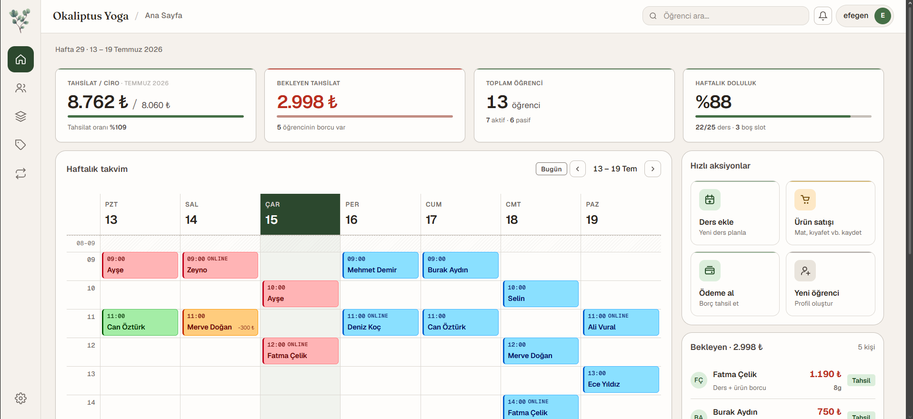
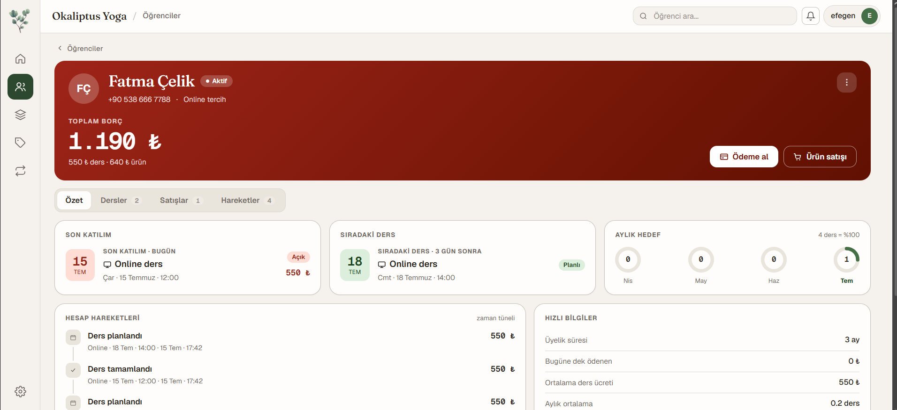
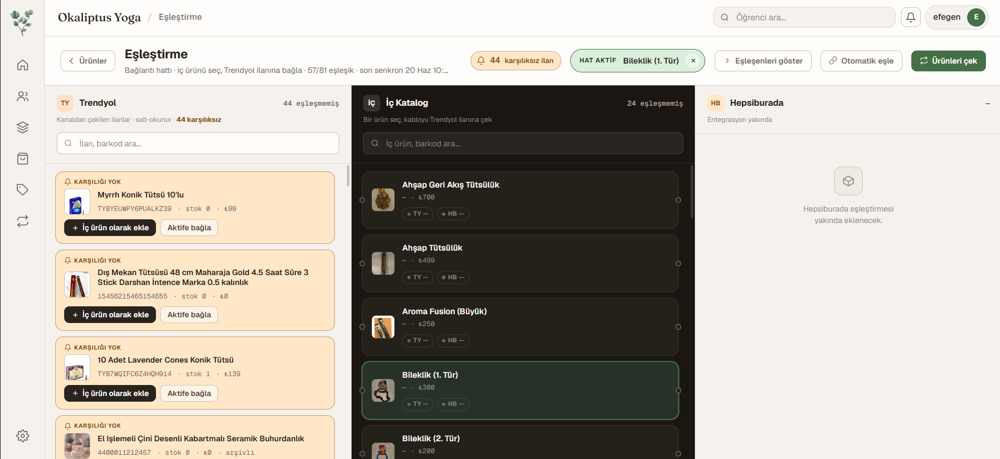
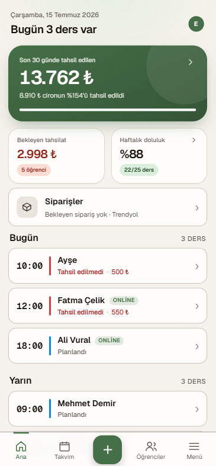
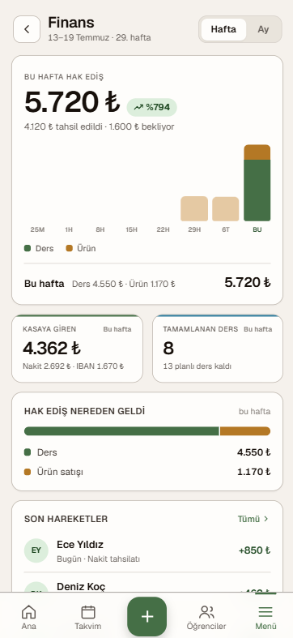
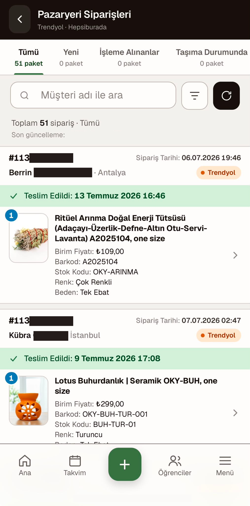

<div align="center">

# 🌿 Okaliptus Studio

**Operations & finance dashboard for a single-instructor yoga studio.**

Students, lessons, payments, prepaid packages, a product catalog, weekly KPIs —
and a full marketplace (Trendyol) integration for stock, orders, and fulfillment.
Built as a focused single-operator tool with a small admin team, installable as a
mobile PWA.

[](https://react.dev/)
[](https://vitejs.dev/)
[](https://www.typescriptlang.org/)
[](https://nodejs.org/)
[](https://www.postgresql.org/)
[](#pwa-installation)


</div>

---

## 📸 Screenshots

### Web

<table>
<tr>
<td align="center" width="33%">

<br><sub><b>Home</b> — weekly calendar, KPIs, quick actions</sub>
</td>
<td align="center" width="33%">

<br><sub><b>Student profile</b> — debt, activity timeline, quick actions</sub>
</td>
<td align="center" width="33%">

<br><sub><b>Marketplace mapping</b> — Trendyol ↔ internal catalog wiring</sub>
</td>
</tr>
</table>

### Mobile

<table>
<tr>
<td align="center" width="33%">

<br><sub><b>Home</b> — today's lessons, pending collections, occupancy</sub>
</td>
<td align="center" width="33%">

<br><sub><b>Finance · Flow</b> — weekly/monthly income by source</sub>
</td>
<td align="center" width="33%">

<br><sub><b>Marketplace orders</b> — live Trendyol/Hepsiburada order list</sub>
</td>
</tr>
</table>

---

## 📑 Table of Contents

- [About](#about)
- [Feature Tour](#feature-tour)
- [Marketplace & Trendyol Integration](#marketplace--trendyol-integration)
- [Tech Stack](#tech-stack)
- [Architecture](#architecture)
- [Screens](#screens)
- [Local Setup](#local-setup)
- [Environment Variables](#environment-variables)
- [Scripts](#scripts)
- [Testing](#testing)
- [Deployment](#deployment)
- [PWA Installation](#pwa-installation)
- [Project Specification](#project-specification)
- [License](#license)

---

## About

Okaliptus Studio is an internal management dashboard purpose-built for a **single
yoga instructor** and a small **admin/operator team** with role-based access
(`owner` / `admin` / `instructor` / `assistant` — see Feature Tour below). It is
not a generic SaaS — it encodes the studio's real rules: how debt accrues, how
prepaid credits are consumed, how prices are snapshotted, and how the week is
reported.

- **Language** — the entire UI, error messages, and user-facing strings are in
  **Turkish**. Code symbols are English (API `camelCase`, DB `snake_case`).
- **Currency / timezone** — TRY only; `Europe/Istanbul`, week starts Monday 00:00.
- **Shape** — root `src/` is the Vite + React frontend (no TypeScript, no React
  Router — manual page routing). `backend/` is an Express + TypeScript API over a
  raw `pg` pool (no ORM). Two independent installs; **not** a monorepo.

The product spec is **v1.5, production-ready**. Full details live in
[`yoga-studio-dashboard-v1-spec.md`](yoga-studio-dashboard-v1-spec.md) — the spec
is the source of truth where it diverges from this README.

---

## Feature Tour

<details open>
<summary><strong>👥 Students & lessons</strong></summary>

- **Students** — profiles, contact info, nickname, preferred mode, and an A11
  activity timeline (Summary / Lessons / Sales / Movements tabs). Soft archive
  **and** permanent cascade hard-delete.
- **Lessons** — weekly calendar home page with a lesson modal driving the full
  lifecycle: complete / cancel / no-show / pay. Status transitions are enforced
  (`completed → cancelled` is forbidden; uncomplete is allowed only within 24h,
  unpaid, with no linked sale).
- **Lesson types & instructors** — configurable lesson types (price, duration);
  full instructor CRUD. Every mutation is audited.
- **Custom student pricing** — a fixed per-student × per-lesson-type price
  (replaces the old manual per-lesson discount). A net-zero lesson shows green on
  the calendar.

</details>

<details>
<summary><strong>💳 Payments, packages & debt</strong></summary>

- **Payments** — per-lesson tracking with partial payment support. Overpayment is
  rejected (`409 OverpaymentNotAllowedError`). Payments are deletable from the
  movement detail modal.
- **Prepaid packages** — N-credit packages with FIFO credit consumption. Package +
  first payment happen in one transaction; `total_amount = credit_count × unit_price`
  is a DB CHECK constraint. A lesson covered by a credit creates **no debt**.
- **Debt model** — debt = completed-lesson net + product-sale total. Scheduled /
  cancelled / no-show lessons never create debt.

</details>

<details>
<summary><strong>🛍️ Product catalog & sales</strong></summary>

- **Catalog** — persistent products with barcode, price, self-hosted image
  (800px square WebP stored in the DB, public GET endpoint), marketplace listing
  URLs, variants/category. Trendyol Excel import.
- **Cart sales** — item-based sales with per-item price snapshots.
- **Receipts** — client-side PNG "thank-you" receipt generated on demand and
  shareable via WhatsApp (never stored; regenerated when asked).
- **Lifecycle** — soft archive; permanent delete allowed only for archived
  products (sale snapshots are preserved).

</details>

<details>
<summary><strong>📊 Finance, occupancy & reporting</strong></summary>

- **Movements** — studio-wide chronological activity feed (sales / lessons /
  payments) with filters and a running summary.
- **Finance · Flow** (mobile) — weekly/monthly income series with a per-source
  breakdown (`/kpi/finance-flow`).
- **Occupancy · Attendance** (mobile) — live weekly/monthly occupancy %, lesson
  revenue vs. cancellations, and a "losing momentum" roster (`/kpi/occupancy-flow`).
- **Weekly KPIs** — the spec's reporting backbone, validated end-to-end by a
  delta-based smoke test.

</details>

<details>
<summary><strong>🔐 Platform: auth, roles, audit, PWA, notifications</strong></summary>

- **Auth** — username/password login, opaque session cookie (not JWT), bcrypt cost
  12, 30-day sliding TTL, server-side revocable, login rate limit (5 / 15 min).
- **Roles (RBAC)** — four fixed roles: `owner`, `admin`, `instructor`,
  `assistant`. Owner/admin/instructor share full access; `assistant` is
  restricted from financial KPIs/revenue, studio movements, marketplace,
  settings/catalog writes, and permanent student delete — everything else
  (lesson CRUD + attendance, student add/edit, payments, product sales,
  calendar, occupancy) is allowed. Capability checks live in
  [`backend/src/auth/permissions.ts`](backend/src/auth/permissions.ts)
  (`can(role, capability)`) and mirror on the frontend in
  [`src/permissions.js`](src/permissions.js) — the frontend only hides UI, the
  backend enforces it. User management (create/role/deactivate/reset password)
  lives in-app under Settings → Users, owner-only.
- **Audit log** — every mutating event (lessons, payments, packages, custom
  prices, settings, lesson-types, instructors, products, users, auth
  login/logout) is tracked with the actor user. Surfaced under Settings →
  Activity.
- **Notifications** — a config-driven Web Push module (lesson-starting / stale
  lesson / new order alerts) read entirely from a DB table, not hardcoded
  logic. Owner-configurable under Settings → Notifications: on/off,
  per-person recipients, scheduling, message templates
  (`{student}`/`{minutes}`/`{time}`/`{customer}`/`{order}`), quiet hours, and a
  test-send button. Runs as an in-process scheduler that only starts once
  VAPID keys are configured.
- **Calendar planning** — lessons can be scheduled ahead with participants
  attached, surfaced from the home calendar.
- **Mobile PWA** — installable to the home screen, offline-cached (Workbox),
  mobile-first shell with bottom-tab navigation.
- **Settings** — studio-wide configuration plus the Users, Notifications, and
  Activity (audit) tabs, and the marketplace feature toggles.

</details>

---

## Marketplace & Trendyol Integration

A full marketplace layer sits behind **DB-stored feature flags** (Settings →
toggles), so each capability can be enabled independently and the studio runs
exactly as before when they're all off. Trendyol API credentials live in env vars;
with no credentials the integration reports "not configured" and nothing else is
affected.

| Capability | Flag | Direction | Notes |
|---|---|---|---|
| Internal stock tracking | — | local | `stock_movements`, bundle/variant stock |
| Channel listings & mapping | — | local | wire internal products ↔ Trendyol listings |
| Catalog sync | `marketplaceSyncEnabled` | read | pull Trendyol listing/product data |
| Order list & detail | `marketplaceOrdersEnabled` | read | live read-only orders (web + mobile) |
| Order → stock sync | `marketplaceOrdersEnabled` | local | decrement stock on sold lines |
| Returns / claims reconciliation | `marketplaceOrdersEnabled` | read | reconcile Trendyol claims |
| Stock push | `marketplaceStockPushEnabled` + `marketplaceStockPushDryRun` | **write** | baseline interlock, circuit breaker, change-only, batch verify |
| Cargo provider change | `marketplaceFulfillmentEnabled` | **write** | live `PUT cargo-providers` with confirmation |
| Shipping label | `marketplaceFulfillmentEnabled` | **write** | Common Label — A4 (PDF) / Sticker (ZPL) |

**Surfaces**

- **Mapping board** ([`src/mapping.jsx`](src/mapping.jsx)) — a "connection wiring"
  cockpit: Trendyol on one side, internal products on the other, live SVG cables,
  barcode auto-matching.
- **Orders** — web [`src/orders.jsx`](src/orders.jsx) and mobile
  [`src/mobile/MobileOrders.jsx`](src/mobile/MobileOrders.jsx) /
  [`MobileOrderDetail.jsx`](src/mobile/MobileOrderDetail.jsx), backed by live
  read-only Trendyol order data.

> ⚠️ Write paths (stock push, cargo change, labels) are guarded by flags **and**
> confirmation dialogs. Treat the first real production write as a deliberate,
> supervised action.

---

## Tech Stack

| Layer | Technology |
|-------|------------|
| Frontend | React 18, Vite 5, TanStack Query v5, plain CSS, manual page routing |
| PWA | `vite-plugin-pwa` + Workbox, mobile shell under `src/mobile/` |
| Receipts / barcodes | `modern-screenshot`, `jsbarcode`, `vaul` |
| Backend | Express 4, TypeScript (strict), Node.js 20+ |
| Data access | raw `pg` Pool, services pattern (no ORM, no DAO) |
| Auth | opaque session cookie, bcrypt cost 12 |
| Marketplace | Trendyol REST client, `xlsx` import, `web-push` (VAPID) |
| Database | PostgreSQL 18 (numbered SQL migrations, no migration tool magic) |
| Hosting | Cloudflare Pages (frontend), Railway (backend + Postgres) |

---

## Architecture

- **Frontend** — JSX only (no TypeScript). Pages are plain components switched by a
  `page` state in [`src/main.jsx`](src/main.jsx) — no router. Server state via
  TanStack Query (`src/hooks/queryKeys.js`). A separate mobile shell
  (`src/mobile/`) is selected by `useIsMobile`.
- **Backend** — Express with a thin router-per-resource layer
  ([`backend/src/server/routes/`](backend/src/server/routes/)) delegating to a
  **services pattern** that calls `pool.query` directly. 18 routers mounted in
  [`backend/src/server/app.ts`](backend/src/server/app.ts).
- **Database** — schema is defined entirely by **numbered SQL migrations** in
  [`backend/migrations/`](backend/migrations/) (`0001+` schema, `0100+` views,
  `0200+` seed & later additions — that folder is the actual count, this README
  doesn't track it). Migrations are one-shot, tracked in `schema_migrations`,
  and **never edited in place** — a fix is a new numbered file.
- **Critical invariants** — price snapshots, status transitions, debt rules, FIFO
  package credits, and overpayment rejection are spelled out in
  [`CLAUDE.md`](CLAUDE.md) and the spec. Ask before breaking them.

---

## Screens

| Screen | Web | Mobile | Backend |
|---|:---:|:---:|---|
| Home (weekly calendar + planning) | ✅ | ✅ | `/lessons`, `/kpi`, `/calendar-events` |
| Students + profile | ✅ | ✅ | `/students` |
| Lesson types & instructors | ✅ (Catalog) | — | `/lesson-types`, `/instructors` |
| Product catalog & sale | ✅ | ✅ | `/products`, `/product-sales` |
| Movements | ✅ | ✅ | `/movements` |
| Finance · Flow | — | ✅ | `/kpi/finance-flow` |
| Occupancy · Attendance | — | ✅ | `/kpi/occupancy-flow` |
| Marketplace mapping | ✅ | — | `/mapping`, `/channels` |
| Marketplace orders | ✅ | ✅ | `/trendyol` |
| Settings → General | ✅ | ✅ | `/settings` |
| Settings → Users (owner-only) | ✅ | ✅ | `/users` |
| Settings → Notifications (owner-only) | ✅ | ✅ | `/notification-settings`, `/push` |
| Settings → Activity (audit) | ✅ | ✅ | `/audit-logs` |

---

## Local Setup

**Prerequisites:** Node.js 20+, PostgreSQL 14+ (production runs 18)

```bash
# 1. Install dependencies (frontend + backend install separately)
npm install
cd backend && npm install && cd ..

# 2. Configure environment
cp backend/.env.example backend/.env
# Edit backend/.env — set DATABASE_URL, PORT, TZ, BOOTSTRAP_* (and Trendyol keys if used)

# 3. Run migrations
cd backend && npm run db:migrate

# 4. Bootstrap (admin accounts + a first instructor if none exists, from .env)
npm run db:bootstrap && cd ..

# 5. Start dev servers (two terminals)
npm run dev                  # Vite frontend on :5173
cd backend && npm run dev    # Express backend on :4000
```

---

## Environment Variables

**Backend** (`backend/.env`, see [`backend/.env.example`](backend/.env.example)):

| Variable | Purpose |
|---|---|
| `DATABASE_URL` | Postgres connection string |
| `PORT` | API port (default `4000`) |
| `TZ` | Must be `Europe/Istanbul` |
| `NODE_ENV` | `development` / `production` |
| `ALLOWED_ORIGINS` | CORS whitelist — **required in prod** (fail-secure) |
| `BOOTSTRAP_ADMINS` | `user:pass,user:pass,...` seeded admin accounts |
| `BOOTSTRAP_INSTRUCTOR_NAME` | First instructor name |
| `BOOTSTRAP_OWNER_USERNAME` | Promotes this seeded user to the `owner` role (idempotent, never demotes) |
| `VAPID_PUBLIC_KEY` / `VAPID_PRIVATE_KEY` / `VAPID_SUBJECT` | Web Push (optional, owner-only) |
| `TRENDYOL_API_BASE_URL` | Trendyol gateway (prod default; override for stage) |
| `TRENDYOL_SELLER_ID` / `TRENDYOL_API_KEY` / `TRENDYOL_API_SECRET` | Trendyol auth (optional) |

**Frontend:** `VITE_API_BASE_URL` (optional; production API origin).

> `.env` is never committed. `backend/.env.example` is the reference.

---

## Scripts

### Backend (run from `backend/`)

```bash
npm run db:migrate           # Run pending SQL migrations (never run SQL by hand)
npm run db:bootstrap         # Seed instructor + admin users from .env
npm run db:backup            # pg_dump (custom format) → backend/backups/
npm run db:size              # DB size check

npm run import:trendyol      # Import products from a Trendyol Excel export
npm run products:export      # Export product catalog
npm run products:import      # Import product catalog
npm run archive:zero-stock   # Archive products with zero stock
npm run seed:trendyol-listings  # Seed channel listings (dev)

# Smoke tests (service-layer integration)
npm run smoke                # Run all smoke tests (sequential, ~60–90s)
npm run smoke -- --bail      # Stop at first failure (CI mode)
npm run smoke -- --only 11,99   # Run specific files
npm run smoke:single -- 11   # Same, alias
npm run smoke:reset          # Reset DB → migrate → bootstrap → run all (clean run)
```

### Frontend (run from repo root)

```bash
npm run dev                  # Vite dev server (port 5173)
npm run build                # Production build → dist/
npm run preview              # Serve built artifacts

npm run test                 # Vitest run (all *.test.{js,jsx})
npm run test:watch           # Watch mode
npm run test:ui              # Vitest browser UI
```

---

## Testing

Two parallel smoke layers:

- **Backend smoke** ([`backend/scripts/smoke/`](backend/scripts/smoke/)) — direct
  service-layer integration tests against a local Postgres. Covers spec §7
  scenarios plus later additions: uncomplete lesson, audit coverage, DB-level
  invariants, auth, KPI end-to-end, product catalog & cart sale, product image,
  student hard-delete, studio movements, custom student prices, occupancy, stock
  tracking, channel listings & mapping, Trendyol order preview/sync/claims, bundle
  stock, stock push, orders list, order label, cargo provider, calendar event
  participants, user roles, the notification scheduler, assistant restrictions,
  and notification settings config. One numbered file per scenario plus a
  delta-based `99-kpi-end-to-end.ts` (safe to run against non-empty data — for a
  fully clean run use `npm run smoke:reset`); the folder itself is the current
  count, not this paragraph.
- **Frontend smoke** ([`src/__tests__/`](src/__tests__/)) — Vitest + React Testing
  Library, component-level with mocked `fetch`. Covers the login form, API client
  behavior (401 dispatch, credential cookies), students list, student profile,
  home dashboard, auth gating, and mobile viewport switching.

**Pre-deploy verification**

```bash
cd backend && npm run smoke:reset   # 1. Backend (full clean run)
cd .. && npm run test               # 2. Frontend
npm run dev                         # 3. Manual browser smoke (backend in another terminal)
```

If all three are green, v1 is production-ready modulo deploy hygiene (below).

---

## Deployment

- **Frontend:** Cloudflare Pages (free tier). Build command `npm run build`, output
  `dist/`. SPA fallback via `public/_redirects` (`/*  /index.html  200`). Build-time
  env: `VITE_API_BASE_URL`.
- **Backend + DB:** Railway (~$5/mo, Express + Postgres in one project). Backend
  binds `0.0.0.0`. Use a custom domain `api.<your-domain>` to share eTLD+1 with the
  frontend (enables `SameSite=None` session cookies).

**Pre-deploy checklist**

- [ ] `ALLOWED_ORIGINS` set on backend (CORS is fail-secure — empty rejects all
      cross-origin requests in production)
- [ ] Login rate limit enabled (5 attempts / 15 min)
- [ ] `VITE_API_BASE_URL` set in Pages build env
- [ ] Cookie `SameSite=None` + `Secure` verified in prod
- [ ] Backend `npm run smoke:reset` green against staging DB
- [ ] Frontend `npm run test` green
- [ ] `/health` wired to the Railway probe
- [ ] Marketplace write flags (`marketplaceStockPushEnabled`,
      `marketplaceFulfillmentEnabled`) reviewed — keep off until intentionally used

### Backups

- **Manual:** `cd backend && npm run db:backup` — `pg_dump` (custom format) to
  `backend/backups/`, with local retention (`BACKUP_KEEP_DAYS`, default 14).
  Requires a PG 18 client.
- **Nightly (active):** [`.github/workflows/db-backup.yml`](.github/workflows/db-backup.yml)
  runs a nightly `pg_dump` (Docker `postgres:18`) at 00:00 Europe/Istanbul,
  GPG-encrypts it (AES-256), verifies it decrypts and `pg_restore --list`s cleanly,
  then uploads it as a GitHub Actions artifact (30-day retention). **The repo is
  public, so the dump is always encrypted before upload** — useless without
  `BACKUP_PASSPHRASE`. Required repo secrets: `DATABASE_URL` (Railway public host)
  and `BACKUP_PASSPHRASE`. **Store the passphrase in a password manager — if lost,
  every artifact is unrecoverable.** Trigger on demand from the Actions tab or
  `gh workflow run db-backup.yml`.

---

## PWA Installation

The app ships as a Progressive Web App — installable to the home screen for a
standalone, offline-cached experience.

- **iOS Safari:** Share → "Add to Home Screen" (Ana Ekrana Ekle)
- **Android Chrome:** Menu → "Install app" (Uygulamayı yükle)

PWA assets live in [`public/`](public/): `pwa-192.png`, `pwa-512.png`,
`pwa-512-maskable.png`, `apple-touch-icon.png`, `favicon.svg`. They are generated
by [`scripts/generate-pwa-icons.mjs`](scripts/generate-pwa-icons.mjs) — **never
hand-edit them**; change the drawing logic there and re-run the script.

---

## Project Specification

Full product spec (Turkish): [`yoga-studio-dashboard-v1-spec.md`](yoga-studio-dashboard-v1-spec.md)

It covers the data model, API contracts, UI page structure, auth flows, and
migration history. Code is the source of truth where spec and implementation
diverge — divergences are documented in §11 of the spec.

---

## License

Private — all rights reserved.
